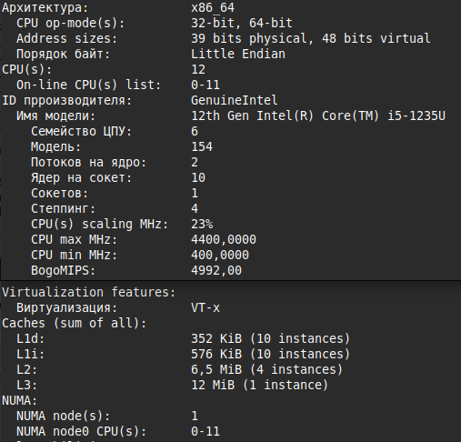

# Проект 3.3.5 Язык самурая

## Содержание
- [0. Аннотация](#аннотация)
- [1. Введение](#введение)
- [2. Методика](#методика)
- [3. Результаты и их обсуждение](#результаты-и-их-обсуждение)
- [4. Выводы](#выводы)
- [5. Приложение](#приложение)

## Аннотация

Создан новый язык программирования - "Язык самурая". Он имеет С-подобный синтаксис и содержит операции, которые необходимы при написании программы для решения квадратных уравнений и программы для вычисления факториала числа. Его преимуществом перед С является возможность одновременно использовать слова по типу `add` или `multiply` и стандартные математические знаки операций, например, `+`, `*`, при выполнении математических преобразований. Программа представляет последовательность операторов, для разделения операторов можно использовать стандартный для синтаксиса С знак `;`, либо более понятное слово `next`. Также он имеет простые и понятные операторы ввода `input ()` и вывода `write_about ()`, которые идеально подходят для вычислительных программ. 

Реализован компилятор "Языка самурая" для моего эмулятора процессора и процессоров архитектуры x86-64. На стадии миддленда проведены две оптимизации: свёртка констант и удаление нейтральных выражений. Эти оптимизации дали возможность использовать выражения с константами, типа `333 * 334`, не переживая за производительность кода. 

Проведены тесты правильности выполнения программ, а также тесты скорости выполнения кода, скомпилированного для разных процессоров. Оказалось, что скомпилированный для процессора х86-64 код выполнялся в 530 раз быстрее, чем тот, который был получен для эмулятора процессора, несмотря на то, что производились одинаковые действия, полученные из одного фронтенда. Из этого сделан вывод, что скорость выполнения программы зависит от архитектуры процессора, для которой компилируется программа, а также от того, насколько оптимальный код генерируется компилятором.

## Введение

Современные языки программирования и компиляторы могут не учитывать специфические требования узкоспециализированных задач, таких как высокоэффективные вычисления, работа с аппаратурой или предметно-ориентированные DSL (Domain-Specific Languages). Их универсальность приводит к избыточности кода и неоптимальному использованию аппаратных ресурсов, что критично для низкоуровневого программирования.

В качестве альтернативы можно использовать существующие языки (например, C или Rust) с дополнительными библиотеками или препроцессорами. Однако такой подход имеет существенные недостатки: во-первых, он не устраняет избыточность синтаксиса и семантики, во-вторых, требует значительных усилий для интеграции с аппаратурой или специализированными алгоритмами. Кроме того, подобные решения часто приводят к усложнению кодовой базы и снижению её сопровождаемости.

Разработка специализированного языка с соответствующим компилятором позволяет точно контролировать генерацию машинного или ассемблерного кода, минимизировать накладные расходы и обеспечивать прямую работу с аппаратными возможностями. Такой подход критически важен для задач, где производительность и предсказуемость исполнения являются ключевыми требованиями.

Целью работы являлось изучение устройства компилятора, создание своего языка программирования и написание компилятора для него на эмулятор процессора и процессоры архитектуры x86-64.

## Методика

Для создания своего языка программирования необходимо составить синтаксис, удобный для целевого применения, и выбрать метод для реализации фронтенда (лексического и синтаксического анализа) языка, в результате работы которого получится промежуточное представление программы. 

Для составления своего синтаксиса нужно проанализировать область применения языка. В зависимости от задачи можно использовать синтаксис, похожий на существующий язык программирования, смешать синтаксис разных языков или использовать для вдохновения эзотерические языки программирования [[1]](https://habr.com/ru/companies/edison/articles/313334/). В качестве алгоритма синтаксического анализа можно использовать рекурсивный спуск.

После работы фронтенда можно провести оптимизации с промежуточным представлением. Например, можно выполнить свёртку констант и удаление нейтральных выражений.

Для написания бэкенда компилятора - программы, которая генерирует машинный или ассемблерный код из промежуточного представления, необходимо определиться с архитектурой, на которой он будет выполняться.

## Результаты и их обсуждение

### Структура языка и компилятора

Выбран С-подобный синтаксис языка (см. Приложение). Набор команд составлен из тех, которые необходимы для написания программ для решения квадратных уравнений и вычисления факториала.

Для моего языка программирования написан фронтенд, обрабатывающий синтаксис функций, циклов, операторов условных переходов, операторов ввода и вывода целых чисел, оператора присваивания и сравнения.

Для первичной обработки кода из текстового файла во фронтенде использован лексический анализатор [[2]](/frontend/hdr/Tokenizer.h), [[3]](/frontend/src/Tokenizer.cpp), преобразующий программу в массив лексем - структур, содержащих информацию об элементе программы: тип элемента и его значение. Для обработки массива лексем использовался алгоритм рекурсивного спуска [[4]](/frontend/hdr/RecursiveReader.h), [[5]](/frontend/src/RecursiveReader.cpp). 

По итогу рекурсивного обхода массива лексем создавалось AST (Abstract Syntax Tree), которое затем представлялось в промежуточном представлении - текстовом файле в префиксном формате полной скобочной записи. Таким образом, получен готовый фронтенд для моего языка программирования.

Над промежуточным представлением проводились оптимизации: свёртка констант и удаление нейтральных выражений. Функции для этих преобразований AST интегрированы из проекта [Differentiator](https://github.com/RTCupid/Differentiator).

Для дальнейшей обработки и компиляции написан бэкенд. Он использовался для преобразования промежуточного представления в инструкции целевой архитектуры. Бэкенд реализован для моего эмулятора CPU процессора (см. проект [Processor](https://github.com/RTCupid/Proccessor)) и для процессоров архитектуры x86-64 (см. Рис. 1). 

<div align="center"></div><br>
<div align="center"> Рис. 1. Характеристики процессора, для которого проводились измерения, полученные при помощи команды 'lscpu' в терминале Linux Mint.</div><br>

Реализация для эмулятора процессора состояла из генерации кода на моём ассемблере [[6]](/backend/hdr/MakeCodeAsm.h), [[7]](/backend/src/MakeCodeAsm.cpp). Для процессора x86-64 написана генерация кода на ассемблере NASM [[8]](/x86_64_backend/hdr/MakeCodeNasm.h), [[9]](/x86_64_backend/src/MakeCodeNasm.cpp). Этот код затем компилировался при помощи NASM и выполнялся на процессоре архитектуры x86-64. 

"Язык Самурая" предназначен для работы только с целыми числами, поэтому для вычислений использовались регистры общего назначения. Операция взятия корня, используемая при написании программы для решения квадратных уравнений [[10]](/programs_in_my_language), реализована при помощи загрузки в регистр `xmm0`, вычисления корня при помощи инструкции `sqrtsd`, и обратной загрузки результата в регистр общего назначения:

```Asm
	cvtsi2sd xmm0, rax                                ; xmm0 = (double) rax
	sqrtsd xmm1, xmm0                                 ; xmm1 = sqrt (xmm0)
	cvtsd2si rdx, xmm1                                ; rdx  = xmm1 
```

Аргумент функции передавался через стек и внутри функции считался локальной переменной. Это позволило написать рекурсивную функцию вычисления факториала [[10]](/programs_in_my_language):

```Asm
	sub rsp, 8                                        ; reserved 8 byte for argument

	mov [rsp], rax                                    ; rax => [rsp], make stack frame;

	call Factorial                                    ; Factorial (rax);
```

Для компиляции таких операторов, как ввод, вывод и завершение программы потребовалось написать библиотеку с их реализацией на ассемблере NASM [[11]](/common/lib/stdlib.s). При её написании использовались наработки из предыдущих проектов, например, функция для вывода десятичного числа частично взята из проекта [MyPrintf](https://github.com/RTCupid/MyPrintf). Библиотека подключалась при помощи директивы `%include`, а в местах использования этих операторов в основной код вставлялась конструкция `call "имя функции для обработки оператора"`:

```
	mov rax, qword [answer]                           ; rax = answer 

	call _my_print                                    ; print (eax) ; number operator 10 
```

### Результаты измерений

Для сравнения производительности кода, полученного при компиляции для эмулятора процессора, и при компиляции для процессора x86-64 (см. Рис. 1), использовался следующий код на "языке Самурая":

```
a = 7 next
b = 12 next
c = 4 next

ntimes = 10000000 next

while (ntimes > 1)
{
    Discriminant = b multiply b subtract 4 multiply a multiply c next

    first_answ  = ((0 subtract 1) multiply b subtract sqrt (Discriminant)) divide (2 multiply a)next
    second_answ = ((0 subtract 1) multiply b add      sqrt (Discriminant)) divide (2 multiply a) next

    ntimes = ntimes - 1 next
} next

then_commit_seppuku
```

По результатам измерений (см. Табл. 1) видно, что код на процессоре х86-64 выполнялся в 530 раз быстрее, чем на эмуляторе процессора, несмотря на то, что производились одинаковые действия, полученные из одного фронтенда.  

| Команда                             | Всего тестов | Среднее время выполнения, с | Минимальное время выполнения, с | Максимальное время выполнения, с |
|-------------------------------------|-------------:|----------------------------:|--------------------------------:|--------------------------------:|
| `./processor/Run.exe Programm_code.txt` |            4 |              93.7 ± 0.7 |                       93.0    |                       94.6    |
| `./build/bin/nasm`                  |           20 |        (177 ± 3) ⋅ 10⁻³ |                173.2 ⋅ 10⁻³     |                184.7 ⋅ 10⁻³     |

Таблица 1. Результаты измерения времени выполнения тестового кода, скомпилированного для эмулятора процессора и процессора с архитектурой x86-64. Измерение проводилось при помощи утилиты hyperfine.

Сделан вывод, что скорость выполнения программы зависит от архитектуры процессора, а также от оптимальности генерируемого кода.

## Выводы

Использование алгоритма рекурсивного спуска для обработки массива лексем себя оправдало, так как оно позволило создать AST, достаточно точно передающее изначальный вид кода и удобное для дальнейшей обработки. С полученным из AST промежуточным представлением оказалось удобно провести такие оптимизации, как свёртка констант и удаление нейтральных элементов.

Полученный для процессора с архитектурой х86-64 код выполнялся в 530 раз быстрее, чем тот, который был получен для эмулятора процессора, хотя производились одинаковые действия, полученные из одного фронтенда. Из этого сделан вывод, что скорость выполнения программы зависит от архитектуры, для которой происходит компиляция, а также от того, насколько оптимальный код генерируется компилятором.

## Список литературы

1.  Примеры кода на 39 эзотерических языках программирования [Электронный ресурс]: статья. - https://habr.com/ru/companies/edison/articles/313334/ (дата обращения - 18.05.2025)

2-3. Лексический анализатор [Файл]: ссылки на файлы из репозитория. - [Tokenizer.h](/frontend/hdr/Tokenizer.h)[Tokenizer.cpp](/frontend/src/Tokenizer.cpp)

4-5. Синтаксический анализатор, реализованный с использованием алгоритма рекурсивного спуска [Файл]: ссылки на файлы из репозитория. - [RecursiveReader.h](/frontend/hdr/RecursiveReader.h), [RecursiveReader.cpp](/frontend/src/RecursiveReader.cpp) 

6-7. Бэкенд для генерации кода, выполняемого на эмуляторе процессора [Файл]: ссылки на файлы из репозитория. -  [MakeCodeAsm.h](/backend/hdr/MakeCodeAsm.h), [MakeCodeAsm.cpp](/backend/src/MakeCodeAsm.cpp)

8-9. Бэкенд для генерации кода, выполняемого на процессорах архитектуры x86-64 [Файл]: ссылки на файлы из репозитория. -  [MakeCodeNasm.h](/x86_64_backend/hdr/MakeCodeNasm.h), [MakeCodeNasm.cpp](/x86_64_backend/src/MakeCodeNasm.cpp))

10. Программы, написанные на моём языке [Папка с файлами]: ссылка на папку из репозитория. - [programs_in_my_language](/programs_in_my_language)

11. Библиотека с реализацией на ассемблере NASM операторов ввода, вывода и завершения программы [Файл]: ссылка на файл из репозитория. - [[stdlib.s]](/common/lib/stdlib.s)

# Приложение 
## Синтаксис реализованного языка программирования

Тесты, используемые для отладки приведены в папке `./tests`[[1]](/tests/) репозитория. На этих примерах можно изучить синтаксис языка.

Ниже приведено описание грамматики языка в близком к РБНФ [[2]](https://divancoder.ru/2017/06/ebnf/) формате, которое обновлялось перед добавлением нового синтаксиса языка:

```
Main
{General    ::= {OP {";" | "next"}}+ Hlt
{OP         ::= Assign | Func | Call | Ret | IF | Print | Input | Hlt

Everything
{Assign     ::= Id "=" Expr
{More       ::= Expr ">" Expr
{Less       ::= Expr "<" Expr
{IF         ::= "if_happen" "(" MORE | LESS | Expr ")"  "{" {OP { ";" | "next" } }+ "}"
{Print      ::= "write_about" "{" Expr "}"
{Input      ::= "input" "(" Id ")"
{While      ::= "while" "(" MORE | LESS | Expr ")" "{" {OP { ";" | "next" } }+ "}"
{Func       ::= Id "(" Id | " " ")" "{" {OP { ";" | "next" } }+ "}"
{Call       ::= Id "(" Id | " " ")" { ";" | "next" }
{Ret        ::= "return" Expr
{Hlt        ::= "then_commit_seppuku" | "$"

Equation
{Expr       ::= T {["+" | "add" | "-" | "subtract"] T}*
{T          ::= P {["*" | "multiply" | "/" | "divide"] P}*
{P          ::= "(" Expr ")" | Num | Id | "sqrt" "(" Expr ")" | Func "(" Expr ")"

Tokens
{Num        ::= NUM
{Id         ::= ID
```
### Список литературы
1. Тестовые программы [Папка с файлами]: ссылка на папку из репозитория. - [tests](/tests/)
2. Расширенная форма Бэкуса - Наура [Электронный ресурс]: статья. - https://divancoder.ru/2017/06/ebnf/ (дата обращения - 21.05.2025)
